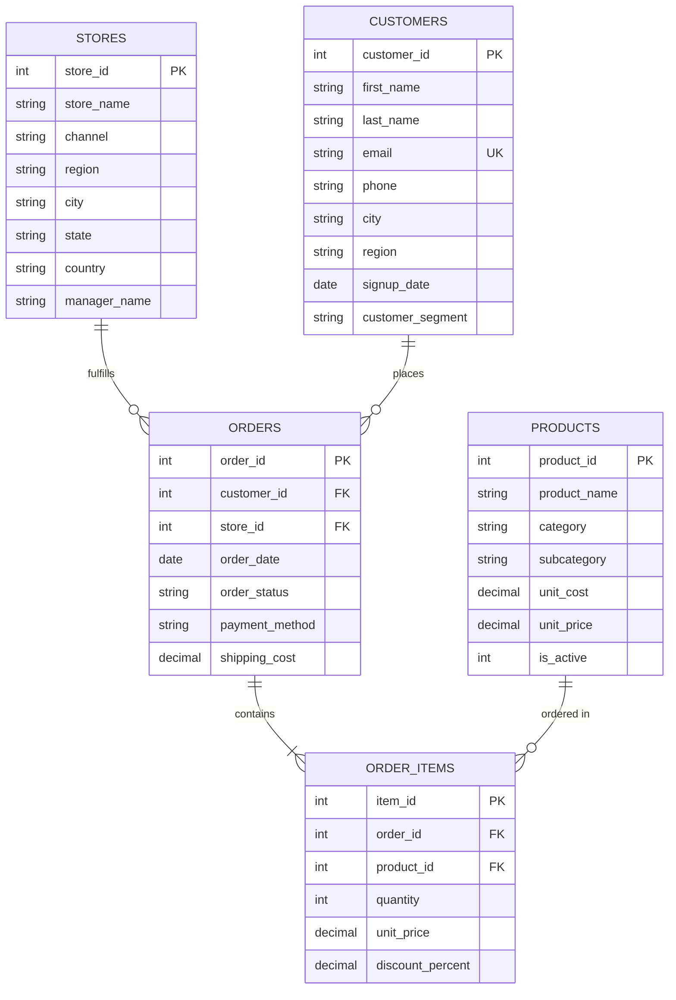

# Lumina Lifestyle & Living - Omnichannel Retail Executive Analytics Platform Flagship Project

[](database/schema.sql)
[](scripts/generate_synthetic_data.py)
[](sql/)
[](tableau/)
[](scripts/app.py)

---

## 1. Executive Business Framing & Problem Statement

> *"Leadership at **Lumina Lifestyle & Living** (an omnichannel retailer selling Premium Home Goods, Smart Electronics, and Outdoor Living across North America, Europe, and Asia Pacific) needs visibility into why net profit margins vary significantly across geographical regions and fulfillment channels (Online E-Commerce vs. Retail Flagship Stores). Management requires clear data to identify which products and customer cohorts drive true bottom-line profitability (not just top-line gross revenue), where promotional discounting is eroding profit margins, and how to optimize customer acquisition and retention budgets."*

Every schema decision, analytical SQL query, stretch script, modular component, and recommendation in this project traces directly back to solving this executive challenge.

---

## 2. Entity-Relationship Diagram (ERD)



---

## 3. Project Architecture & Directory Structure

```
retil project/
├── data/                          # 5 customer demographic, store, and order CSV datasets (16,832 line items)
├── database/
│   ├── schema.sql                 # Fully normalized DDL with PK/FK, CHECKs & annotated indexes
│   ├── views.sql                  # Single-source-of-truth analytical view: vw_sales_analytics
│   ├── data_validation.sql        # Automated assertion suite testing data clean property
│   └── lumina_retail.db           # SQLite database generated via ETL pipeline
├── sql/
│   ├── 01_monthly_trends_mom_yoy.sql         # MoM & YoY revenue/profit growth (LAG)
│   ├── 02_product_performance_rankings.sql    # Category rankings (DENSE_RANK, RANK, ROW_NUMBER)
│   ├── 03_cohort_retention_analysis.sql      # 24-month signup cohort retention & repeat rate
│   ├── 04_rfm_segmentation.sql               # 5-stage CTE chain RFM customer segmentation
│   ├── 05_regional_channel_margins.sql       # Channel vs. region discount & margin comparison
│   └── 06_moving_averages_running_totals.sql # 7-day & 30-day moving averages & YTD totals
├── tableau/                       # Tableau Workbooks & Dashboards
│   ├── RETAIL_MARKET.twb          # Tableau XML Workbook layout
│   └── RETAIL_MARKET.twbx         # Packaged Tableau Workbook
├── scripts/
│   ├── generate_synthetic_data.py # Synthetic data generator modeling seasonal noise & returns
│   ├── etl_pipeline.py            # Automated ingestion & validation script into SQLite
│   ├── app.py                     # Streamlit flagship web application router
│   ├── app_components/            # Modular UI components (Executive Overview, Product Studio, Customer 360, Market Basket, Forecasting, SQL Sandbox)
│   └── utils/                     # Utility engines (Database, Cache, Metrics, RFM, Recommendation, Forecasting, Exporter, Security Validator)
├── docs/
│   ├── data_dictionary.md         # Column-by-column metadata table & sample values
│   ├── business_insights.md        # 7 quantified executive findings & strategic recommendations
│   ├── market_basket_analysis.md   # Market basket co-purchasing association rules
│   ├── executive_summary_report.md# Automated executive performance summary report
│   ├── interview_qa.md             # 12 technical and STAR behavioral interview Q&As
│   └── tableau_specifications.md   # Tableau dashboard layout, calculated fields & action filters
├── requirements.txt               # Streamlit Cloud deployment requirements
└── README.md                      # Primary project portfolio landing page
```

---

## 4. Tableau Dashboard & Platform Tabs

### 📊 Tableau Desktop Workbook (`tableau/`)
- **Dashboard**: `Lumina Retail — Sales & Profitability Overview, 2024–2026`
- **Worksheets**:
  - `TOTAL REVENUE` / `TOTAL PROFIT` / `TOTAL ORDERS` Executive KPI Banner Cards.
  - `Monthly Sales Trend` Time-series line chart.
  - `Global Regional Sales.` Geographic Map.
  - `Channel Profitability` Online E-Commerce vs Physical Flagship Store comparison.
  - `Top 10 Products by Profit` Ranked bar chart.

### 💻 Streamlit Web Application (`scripts/app.py`)
1. **🏠 Executive Overview Command Center**: 8 Groww-Style Metric Cards, Alert banners, 5 AI Insights, Plotly smooth splines, Global Choropleth & Bubble Maps.
2. **📦 Product Intelligence Studio**: Searchable catalog table, ABC classification, Pareto 80/20 analysis chart, Real-Time Discount Simulator.
3. **👥 Customer Analytics & 360° Profile**: Customer 360 Individual Lookup Tool, RFM segment distribution, 24-Month Cohort Retention Heatmap.
4. **🛒 Market Basket Explorer**: Support/Confidence/Lift sliders, Product Bundle Cross-Sell Recommender.
5. **📈 Forecasting Studio**: YoY growth, confidence interval, inflation sliders driving Optimistic, Base, and Pessimistic scenario curves.
6. **🧠 SQL Analytics Lab & Exporter**: Interactive SQL sandbox, SELECT-only security engine, CSV/Excel/Markdown/HTML report exporters.

---

## 5. Quickstart Setup & Execution Guide

### Prerequisites
- Python 3.8+
- SQLite3 CLI
- Tableau Desktop / Tableau Reader (optional)

### Step 1: Clone Repository & Generate Dataset
```bash
git clone https://github.com/VISHANTGARG18/retail-sales-analytics.git
cd retail-sales-analytics

# Generate synthetic transaction dataset (16,800+ line items)
python3 scripts/generate_synthetic_data.py
```

### Step 2: Run Automated ETL Ingestion & Data Validation
```bash
# Builds SQLite database, applies DDL schema, views, and integrity assertions
python3 scripts/etl_pipeline.py
```

### Step 3: Launch Interactive Streamlit Web Platform
```bash
pip install -r requirements.txt
streamlit run scripts/app.py
```

---

## 6. Resume & Portfolio Bullet Points

- **Engineered an end-to-end retail executive analytics platform** in SQLite & Streamlit querying 16,800+ line items across 2 full years (2024–2025), pre-computing metrics via `vw_sales_analytics`.
- **Designed interactive Tableau Workbooks & Dashboards** (`tableau/RETAIL_MARKET.twbx`) visualizing regional profit margin efficiency, channel performance, and top product category drivers.
- **Authored advanced SQL analytics suite** utilizing window functions (`LAG`, `DENSE_RANK`, `SUM() OVER`) and multi-step CTE chains to calculate MoM/YoY growth rates, product category rankings, and 30-day moving average revenue trends.
- **Developed a 5-stage CTE RFM customer segmentation model** classifying 1,500 customers into strategic tiers, revealing that 28.98% of customers ("Champions") generated 61.3% of total net profit ($1.77M).
- **Built a Market Basket Association Engine & Discount Simulator** in Python computing Support, Confidence, and Lift metrics to identify high-converting product checkout cross-sell bundles.
