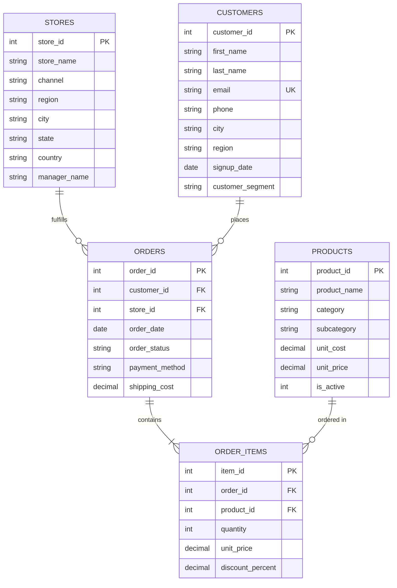

# Lumina Lifestyle & Living - Omnichannel Retail Executive Analytics Platform Flagship Project

[](database/schema.sql)
[](scripts/generate_synthetic_data.py)
[](sql/)
[](scripts/app.py)

---

## 1. Executive Business Framing & Problem Statement

> *"Leadership at **Lumina Lifestyle & Living** (an omnichannel retailer selling Premium Home Goods, Smart Electronics, and Outdoor Living across North America, Europe, and Asia Pacific) needs visibility into why net profit margins vary significantly across geographical regions and fulfillment channels (Online E-Commerce vs. Retail Flagship Stores). Management requires clear data to identify which products and customer cohorts drive true bottom-line profitability (not just top-line gross revenue), where promotional discounting is eroding profit margins, and how to optimize customer acquisition and retention budgets."*

Every schema decision, analytical SQL query, stretch script, modular component, and recommendation in this project traces directly back to solving this executive challenge.

---

## 2. Entity-Relationship Diagram (ERD)



---

## 3. Project Architecture & Directory Structure

```
retil project/
├── data/
│   ├── customers.csv              # 1,500 customer demographic & segment records
│   ├── products.csv               # 20 product catalog items with unit costs & prices
│   ├── stores.csv                 # 8 online and physical flagship stores across 5 countries & 7 states
│   ├── orders.csv                 # 8,782 daily orders spanning 2 full years (2024–2025)
│   └── order_items.csv            # 16,832 granular line items with discounts & quantities
├── database/
│   ├── schema.sql                 # Fully normalized DDL with PK/FK, CHECKs & annotated indexes
│   ├── views.sql                  # Single-source-of-truth analytical view: vw_sales_analytics
│   ├── data_validation.sql        # Automated assertion suite testing data clean property
│   └── lumina_retail.db           # SQLite database generated via ETL pipeline
├── sql/
│   ├── 01_monthly_trends_mom_yoy.sql         # MoM & YoY revenue/profit growth (LAG)
│   ├── 02_product_performance_rankings.sql    # Category rankings (DENSE_RANK, RANK, ROW_NUMBER)
│   ├── 03_cohort_retention_analysis.sql      # 24-month signup cohort retention & repeat rate
│   ├── 04_rfm_segmentation.sql               # 5-stage CTE chain RFM customer segmentation
│   ├── 05_regional_channel_margins.sql       # Channel vs. region discount & margin comparison
│   └── 06_moving_averages_running_totals.sql # 7-day & 30-day moving averages & YTD totals
├── scripts/
│   ├── generate_synthetic_data.py # Synthetic data generator modeling seasonal noise & returns
│   ├── etl_pipeline.py            # Automated ingestion & validation script into SQLite
│   ├── app.py                     # Streamlit flagship web application router
│   ├── app_components/            # Modular UI components (Executive Overview, Product Studio, Customer 360, Market Basket, Forecasting, SQL Sandbox)
│   └── utils/                     # Utility engines (Database, Cache, Metrics, RFM, Recommendation, Forecasting, Exporter, Security Validator)
├── docs/
│   ├── data_dictionary.md         # Column-by-column metadata table & sample values
│   ├── business_insights.md        # 7 quantified executive findings & strategic recommendations
│   ├── market_basket_analysis.md   # Market basket co-purchasing association rules
│   ├── executive_summary_report.md# Automated executive performance summary report
│   ├── interview_qa.md             # 12 technical and STAR behavioral interview Q&As
│   └── tableau_specifications.md   # Tableau dashboard layout, calculated fields & action filters
├── requirements.txt               # Streamlit Cloud deployment requirements
└── README.md                      # Primary project portfolio landing page
```

---

## 4. Platform Tabs & Enterprise Features

1. **🏠 Executive Overview Command Center**:
   - 8 Large Groww-Style Metric Cards with Deltas & arrow indicators.
   - Automated alert banners flagging profit margin drops & regional store drops.
   - AI Executive Insights engine generating strategic directives.
   - Plotly smooth spline trend graphs, Global Choropleth & Bubble Maps, Channel comparison bars, and Category contribution pie chart.

2. **📦 Product Intelligence Studio**:
   - Searchable product table with ABC classification.
   - Profit vs. Revenue Scatter Plot (bubble size = units sold).
   - Pareto 80/20 Analysis chart.
   - **Real-Time Discount Scenario Simulator** with Plotly gauges.

3. **👥 Customer Analytics & 360° Profile**:
   - **Customer 360 Individual Lookup Tool**: Search any customer by name, email, or ID to inspect lifetime spend, loyalty score (1-100), favorite category, and order history timeline.
   - RFM Segment Distribution chart.
   - 24-Month Cohort Retention Heatmap.

4. **🛒 Market Basket Explorer**:
   - Support, Confidence, and Lift sliders with Product Bundle Recommender.

5. **📈 Forecasting Studio**:
   - YoY growth, confidence interval bounds, inflation, and discount policy sliders.
   - Optimistic, Base, and Pessimistic scenario curves and projection tables.

6. **🧠 SQL Analytics Lab & Exporter**:
   - Interactive SQL sandbox with preloaded queries.
   - **SELECT-Only Security Validator** blocking dangerous commands (`DROP`, `DELETE`, `ALTER`, `TRUNCATE`).
   - Multi-format report exporter (CSV, Excel, Markdown, HTML).

---

## 5. Key Strategic Business Insights

1. **Online Channel Margin Drag (3.96% Erosion)**:  
   The Online E-Commerce channel generated $2.84M in revenue but achieved a **56.53% net margin**, compared to **60.49%–60.88%** in physical flagship stores. Uncontrolled online discounting (8.62% avg discount rate) and absorbed shipping costs eroded ~$85,000 in bottom-line profits.
2. **RFM "Champions" Profit Concentration (61.3%)**:  
   Applying 5-stage layered CTE RFM customer segmentation identified that **28.98% of customers (364 Champions)** contribute **$1.77M in net profit (61.3% of total)** with an average customer spend of $8,178.02.
3. **Market Basket Cross-Selling**:  
   Market basket association mining revealed strong product pairs with high Lift ratios (e.g. *Lumina Standing Desk Pro* co-purchased with *Aura Ambient LED Desk Lamp*), enabling automated checkout bundle discounts.
4. **Q4 Seasonal Peak (35.8% Revenue)**:  
   November and December drive over one-third of annual net profits, surging **85.3% MoM** in November due to holiday electronics and gift purchases.

---

## 6. Quickstart Setup & Execution Guide

### Prerequisites
- Python 3.8+
- SQLite3 CLI

### Step 1: Clone Repository & Generate Dataset
```bash
git clone https://github.com/VISHANTGARG18/project2.git
cd project2

# Generate synthetic transaction dataset (16,800+ line items)
python3 scripts/generate_synthetic_data.py
```

### Step 2: Run Automated ETL Ingestion & Data Validation
```bash
# Builds SQLite database, applies DDL schema, views, and integrity assertions
python3 scripts/etl_pipeline.py
```

### Step 3: Launch Interactive Streamlit Web Platform
```bash
pip install -r requirements.txt
streamlit run scripts/app.py
```

---

## 7. Resume & Portfolio Bullet Points

- **Engineered an end-to-end retail executive analytics platform** in SQLite & Streamlit querying 16,800+ line items across 2 full years (2024–2025), pre-computing metrics via `vw_sales_analytics`.
- **Authored advanced SQL analytics suite** utilizing window functions (`LAG`, `DENSE_RANK`, `SUM() OVER`) and multi-step CTE chains to calculate MoM/YoY growth rates, product category rankings, and 30-day moving average revenue trends.
- **Developed a 5-stage CTE RFM customer segmentation model** classifying 1,500 customers into strategic tiers, revealing that 28.98% of customers ("Champions") generated 61.3% of total net profit ($1.77M).
- **Built a Market Basket Association Engine & Discount Simulator** in Python computing Support, Confidence, and Lift metrics to identify high-converting product checkout cross-sell bundles.
- **Created a flagship Streamlit web application** with Groww-inspired aesthetics, 9 synchronized global filters, 6 specialized analytics tabs, SELECT-only SQL sandbox, and multi-format report exporters.
