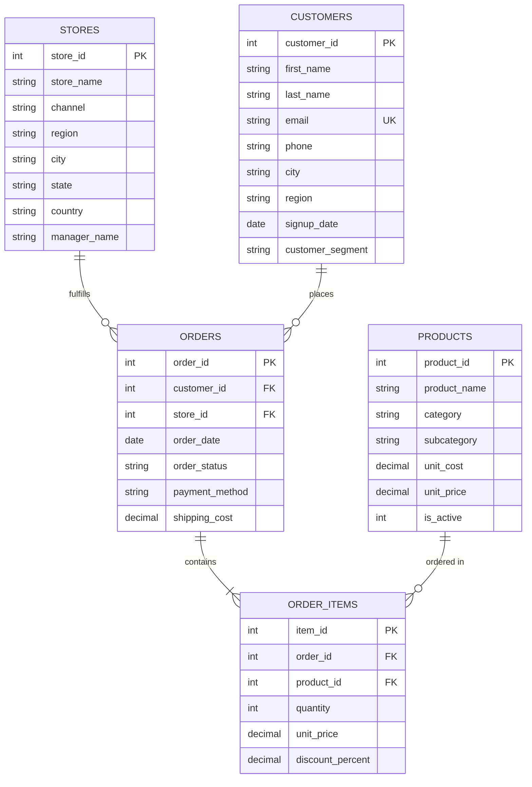

# Omnichannel Retail Analytics Platform: Lumina Lifestyle & Living

An end-to-end retail sales and customer analytics platform built with **SQLite, Python, Streamlit, and Tableau Desktop**. The project models 16,800+ order line items across 2024–2025 to analyze sales performance, customer lifetime value (RFM), product margin efficiency, and channel profitability across online e-commerce and retail store locations.

---

## Overview & Business Context

Retail organizations selling across both online e-commerce and physical store locations often experience margin variance due to shipping overhead, regional discounting, and customer purchasing behaviors. 

This repository implements a complete data pipeline and reporting stack for **Lumina Lifestyle & Living**, a multi-region retail catalog selling Smart Electronics, Premium Home Goods, and Outdoor Living products.

### Key Objectives
- **Data Ingestion & Integrity**: Ingest 16,800+ transactional line items into a normalized SQLite database with schema integrity constraints (`CHECK`, foreign keys `ON DELETE RESTRICT`).
- **Single Source of Truth**: Pre-compute financial metrics (gross revenue, discounts, net revenue, COGS, allocated shipping, net profit, margin %) in a primary analytical view (`vw_sales_analytics`).
- **Advanced Customer Analytics**: Implement a 5-stage CTE RFM customer segmentation model and a 24-month signup cohort retention heatmap.
- **Interactive Dashboards**: Provide executive visibility via an interactive Streamlit web application and a Tableau Desktop dashboard (`tableau/RETAIL_MARKET.twbx`).

---

## Entity-Relationship Diagram (ERD)



---

## Repository Structure

```
.
├── data/                          # CSV datasets (customers, products, stores, orders, order items)
├── database/
│   ├── schema.sql                 # DDL schema (tables, PK/FK constraints, CHECK rules, indexes)
│   ├── views.sql                  # Analytical view: vw_sales_analytics
│   ├── data_validation.sql        # Assertion validation script for data integrity
│   └── lumina_retail.db           # Generated SQLite database
├── sql/
│   ├── 01_monthly_trends_mom_yoy.sql         # MoM & YoY revenue and profit growth trends
│   ├── 02_product_performance_rankings.sql    # Category rankings (DENSE_RANK, RANK, ROW_NUMBER)
│   ├── 03_cohort_retention_analysis.sql      # 24-month signup cohort retention matrix
│   ├── 04_rfm_segmentation.sql               # 5-stage CTE chain RFM customer segmentation
│   ├── 05_regional_channel_margins.sql       # Channel vs. region discount and margin comparison
│   └── 06_moving_averages_running_totals.sql # 30-day moving averages and YTD running totals
├── tableau/                       
│   ├── RETAIL_MARKET.twb          # Tableau Desktop workbook file
│   └── RETAIL_MARKET.twbx         # Packaged Tableau workbook
├── scripts/
│   ├── generate_synthetic_data.py # Synthetic data generation engine
│   ├── etl_pipeline.py            # SQLite ingestion and validation pipeline
│   ├── app.py                     # Streamlit web application entry point
│   ├── app_components/            # Modular dashboard UI tabs
│   └── utils/                     # Backend helper modules (metrics, rfm, forecasting, exports)
├── docs/                          # Data dictionary and business analysis notes
└── requirements.txt               # Dependencies for app deployment
```

---

## Core Analytical Findings

- **Online Channel Margin Drag**: The Online E-Commerce channel generated $2.84M in revenue at a **56.53% net margin**, compared to **60.49%–60.88%** in physical flagship stores (a 3.96% margin drag). Higher online promotional discounting (avg 8.62%) and shipping overhead accounted for ~$85,000 in margin erosion.
- **Customer Profit Concentration**: Using a 5-stage CTE RFM model, **28.98% of customers (364 Champions)** generated **$1.77M in net profit (61.3% of total net profit)**, averaging $8,178 in lifetime revenue per account.
- **Seasonal Revenue Pattern**: November and December accounted for **35.8% of annual net profit**, with November net revenue increasing **85.3% MoM** due to holiday purchasing volume.
- **High-Margin Product Categories**: The *Outdoor Living* category achieved a category-leading **61.19% net profit margin**, led by premium cooler and outdoor furniture product lines.

---

## Technical Stack & SQL Implementation

### SQL Analytics Suite
- **Window Functions (`LAG`, `DENSE_RANK`, `SUM() OVER`)**: Calculated Month-over-Month and Year-over-Year revenue/profit growth rates, partitioned category rankings, and 30-day moving averages.
- **Multi-Stage CTE Chains**: Segmented 1,500 customers across Recency, Frequency, and Monetary dimensions using `NTILE(5)` window functions into 5 distinct tiers (*Champions, Loyalists, Potential Loyalists, At Risk, Lost*).
- **Single-Source View (`vw_sales_analytics`)**: Joins 5 normalized tables and computes line-level Gross Revenue, Discounts, Net Revenue, COGS, allocated shipping, Net Profit, and Profit Margin %.

### Streamlit Application Features
- **Global Multi-Filter Sidebar**: 9 synchronized filters (Date Range, Country, Region, Store, Channel, Category, Segment, Search).
- **Executive & Category Tabs**: Visualized KPIs, product profit scatter plots, ABC classifications, Customer 360 account profiles, and Market Basket co-purchasing rules.
- **Scenario Simulator & Forecasting**: Interactive sliders for promotional discount capping, free shipping thresholds, and YoY time-series projections.
- **SQL Lab**: Interactive query editor with a `SELECT`-only execution validator blocking write/delete operations.

---

## Setup & Running Locally

### 1. Requirements
- Python 3.8+
- SQLite3

### 2. Installation & Ingestion
```bash
git clone https://github.com/VISHANTGARG18/retail-sales-analytics.git
cd retail-sales-analytics

# Install dependencies
pip install -r requirements.txt

# Generate dataset & build SQLite database
python3 scripts/generate_synthetic_data.py
python3 scripts/etl_pipeline.py
```

### 3. Launch Streamlit Application
```bash
streamlit run scripts/app.py
```

### 4. Open Tableau Dashboard
Open `tableau/RETAIL_MARKET.twbx` in Tableau Desktop or Tableau Reader to inspect the workbook visual design.
